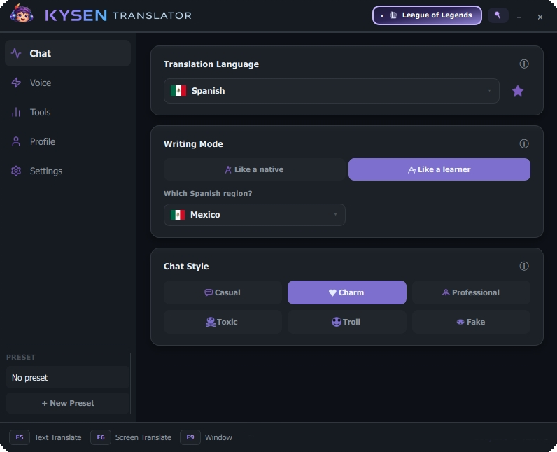

  
  
  

  

  

<b>Speak without borders.</b>

  

---

Kysen is a Windows app for gamers who play across languages. It translates your chat, reads the screen for you, and carries your voice into another language, all without leaving the game.

  <a href="#features">Features</a> •
  <a href="#quick-start">Quick Start</a> •
  <a href="#plans">Plans</a> •
  <a href="#support">Support</a>

---

## Get Kysen

**Download:** [Website](https://kysenai.com) · [Latest build](https://github.com/kysenz/kysen-translator/releases/latest)

---

## Why use it

- Hotkeys write, translate, and send your message without leaving the game.
- On-screen text gets captured and translated live, so you always know what's going on around you.
- Speak in your language, teammates hear it in theirs, and it still sounds like you, even out loud.
- Multiple chat styles keep replies sounding like a real person typed them, not raw machine output.
- Sign in and it's ready, no setup hassle.

---

## Quick start

1. Download from [kysenai.com](https://kysenai.com)
2. Install and sign in
3. Press **F5** and start using it

**Hotkeys** (customizable):

| Key | Action |
|:----|:-------|
| **F5** | Translate and send text |
| **F6** | Capture and translate on-screen text |
| **F9** | Show or hide the window |

---

## Features

Click any feature to expand.

<b>Text chat translation</b> · Write in your language, send in theirs, instantly

 

Type normally. Kysen rewrites the message into the other player's language and sends it for you, so you never leave the game to open a translator.

<b>Screen capture</b> · Read and translate on-screen chat without alt-tabbing

 

Select a region of the screen. Kysen reads the text there and shows you a live translation, useful when the other side is typing in a language you don't know.

<b>Voice chat</b> · Speak in your language, they hear it translated, and it still sounds like you

 

Built for voice lobbies (Valorant, CS, Discord parties, and similar). Speak into your mic, Kysen translates in real time, and teammates hear it spoken back in their language without it sounding like a flat robot voice.

<b>Chat styles</b> · Pick a personality for every message, not just a translation

 

This is the feature people end up loving the most. Kysen doesn't only change the language, it changes the vibe.

- **Casual** talks like a real player, not a textbook.
- **Charm** is smooth, flirty, and confident.
- **Professional** stays clean and respectful.
- **Toxic** brings the heat (use responsibly).
- **Troll** is chaotic, made for the memes.
- **Fake** is the odd one out: it writes text that *looks* like the target language but isn't real words at all. It sounds right at a glance, yet it's nonsense built to feel native.

Same words, completely different energy, in any of the 32 supported languages.

<b>Writing mode</b> · Sound like a native, or like someone still learning

 

- **Like a native** uses full grammar and everyday rhythm, as if you grew up speaking that language.
- **Like a learner** is softer and easier, closer to a strong student than a local.

Pick the vibe that fits who you want to sound like in chat.

<b>Latin letters / Real alphabet</b> · For games that can't show every script

 

Some games break on Cyrillic, Arabic, Kanji, and similar scripts. When that happens, switch to **Latin letters** so chat stays readable in-game.

If the game supports the real writing system, use **Real alphabet** instead and keep the authentic script.

<b>32 languages</b> · Tuned for natural in-game chat, not textbook phrasing

 

Translations are built for how people actually talk in games: short, fast, and natural, not stiff classroom language.

<b>Smart Reply</b> · Context-aware reply suggestions when you're not sure what to say

 

When chat is moving fast, Smart Reply suggests answers that fit the conversation so you can respond without freezing up.

<b>Real-time flow</b> · No alt-tab, no interruptions, translations keep up with the game

 

Hotkeys and overlays keep you in the match. Translate, send, and keep playing without breaking focus.

<b>Cache</b> · Skips reprocessing messages it has already translated

 

Repeated lines and common chat phrases resolve faster because Kysen remembers what it already handled.

---

## Plans

Every feature is included in your subscription. No extra purchases, no separate setup per feature.

Manage your account and plans on the [Website](https://kysenai.com).

---

## Support

Need help, found a bug, or just want updates?

Join our [Discord](https://discord.gg/XdCdUbGxHf). That's the fastest place to get support.

---

## About

Kysen Translator is built and maintained by the Kysen team.

Proprietary software. All rights reserved. Distributed as a compiled Windows app; this repository is a product page, not the source code.

[Website](https://kysenai.com) · [Discord](https://discord.gg/XdCdUbGxHf)

---

<i>Kysen Translator · Windows</i>

